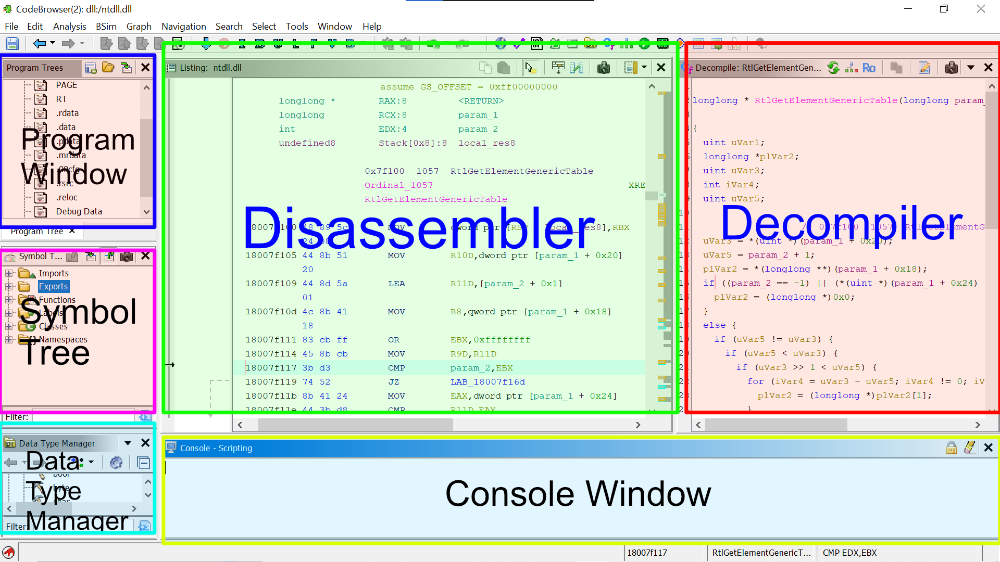

# 4.3 Tool Guides

It's important to know how to use the software you are using. This lesson will cover some tool basics. It's best to use this lesson as a reference when the tools first get introduced.

>  When you download Ghidra and x64dbg, you’ll notice they come as portable `.zip` archives instead of standard installers. Because analysts frequently execute these tools inside disposable VMs or directly from encrypted USBs, the software must be completely self-contained. Standard installers make messy system modifications, whereas a portable archive leaves the host system completely untouched. Mind you, these tools are industry standard, state of the art software. If you can successfully master and work with these tools to their fullest extent, then consider yourself a professional ;) .
# x64dbg

  

x64dbg has a feature called "Analysis" which will analyze a portion of the disassembly. This analysis will give us more information such as comments on the right with information. There is a plugin that you can use for even better analysis called [xAnalyzer](https://github.com/ThunderCls/xAnalyzer). I use it and I would recommend it, although it is not required for this course.

### Main Tabs

Near the top of x64dbg, you will see many tabs which will aid us in our reversing.

* **CPU** this is the disassembly.
* The **graph** tab is useful for conditionals. To graph, you have to select the area you want to graph then right click and choose "Graph" or just press "G".
* **Log** is just logging information for x64dbg and can't be ignored for pretty much everything.
* **Notes** allows you to take notes. Global notes will be seen when reversing any binary. Debuggee notes will only be seen when reversing the specific binary they were written for.
* **Breakpoints** shows all set breakpoints.
* **Memory Map** shows sections in memory and where they are located.
* **Call Stack** shows function calls and what's currently on the call stack.
* **SEH** is short for Structured Exception Handler. These are errors that are handled.
* **Script** is for scripting. We will ignore this.
* **Symbols** shows all program symbols, primarily function names.
* **Source** shows the source code if it's available.
* **References** shows any references such as string references. You can populate this tab by going to the CPU tab then right clicking and choosing either "Search for" or "Find references to".
* **Threads** shows currently running threads that have something to do with the process.
* **Snowman** is a decompiler. To populate the decompiler go to the CPU view, select a portion of code, then right-click and choose "Decompile". Snowman isn't a good decompiler, but it's not bad either.
* **Handles** shows all of the programs handles.
* **Trace** will show a trace of a section of the program. Traces allow you to "debug statically" once you have traced a section.

### Memory Window

In the memory window, you have several different tabs. You have five different "Dumps" which are areas in memory. There is a "Watch" tab which allows you to watch parts memory and variables that you choose. "Locals" are local variables. "Struct" allows you to analyze structures.

### Stack Window

The stack window shows the stack. The address of the current stack pointer is highlighted.

### Register Window

Shows all registers. You can right-click the registers and do things with/to them.

### Saving and Databases

x64dbg automatically saves your progress. If you want to manually save your progress you can do so with databases. You can import and export databases under the "File" tab. Databases are also useful for sharing between computers.

### Settings

Here are my settings:

  

  

  

  

  

  

# Ghidra

Ghidra is a good reversing framework made by our friends at the NSA. The main reason why I use Ghidra is for the decompiler which is very good when compared with other compilers.

  

Unlike x64dbg, Ghidra may look very dense and complicated. If you are a beginner, you don't need to worry about all these complexities. My advice is: Don't try to understand everything you see on screen, we mainly focus on symbol trees, disassembler and decompiler at the time.
Everything else you will simply learn when the need arises.
### Disassembler

This is where the disassembly happens. This window is just called the listing window.
### Decompiler

Where C code is shown, you can click any line in here and it will show you the corresponding line in assembly and vice versa. This is great for learning assembly.
### Symbol Tree

All the symbols are classified in structured, ordered manner, like functions, imports (code that is borrowed from external library's), and exports (the code the file give out for sharing).
### Data type manager

This window lets you manage, apply, and organize data types in the file.
### Program window

This shows the raw memory layout of the file, like `.text` and `.data` etc.
### Console window

This is where errors, warnings, and output from any automated scripts that we run would show up.

[<- Previous Lesson](4.2%20Debugging.md)  
[Next Lesson ->](../Chapter%205%20-%20BasicReversing/5.0%20BasicReversing.md)  

[Chapter Home](4.0%20Tools.md)  
